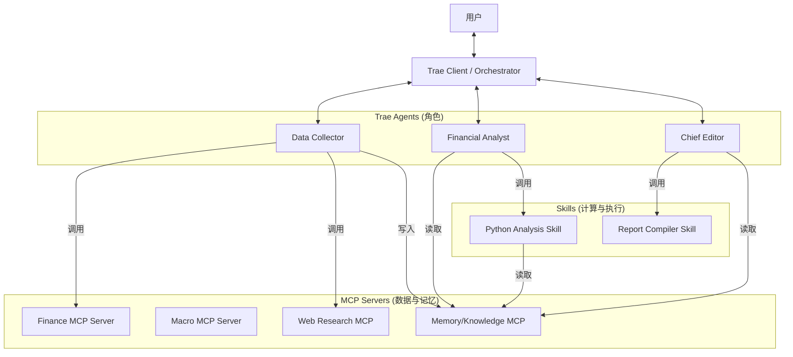

# FinSight 架构重构方案：Trae Agents + MCP + Skills

本文档详细描述了将 FinSight 从单体多智能体应用迁移到 **Trae Agents + MCP (Model Context Protocol) + Skills** 架构的完整技术方案。

## 1. 核心目标
*   **解耦**: 将数据工具、记忆模块与业务逻辑分离，提升复用性。
*   **标准化**: 使用 MCP 协议统一接口，允许 Trae 或其他 AI 客户端无缝调用。
*   **解决上下文限制**: 通过 RAG（检索增强生成）机制，解决海量金融数据无法直接放入 LLM 上下文的问题。

## 2. 目标架构概览

新架构由三层组成：**Trae Client (编排层)**、**MCP Servers (服务层)** 和 **Skills (能力层)**。

---

## 3. 详细组件设计

### 3.1. MCP Servers (资源与工具)

这部分负责“提供原材料”和“存储记忆”。我们将 FinSight 的 `src/tools` 和 `src/memory` 拆分为独立服务。

#### A. `finance-mcp-server`
*   **功能**: 提供股票基础信息、财报、持股结构等数据。
*   **数据源**: 复用 `src/tools/financial` (AkShare)。
*   **关键接口**:
    *   `get_stock_profile(ticker)`: 获取公司简介。
    *   `get_financial_statements(ticker, type)`: 获取三大表。
*   **特殊逻辑**: 获取到的大型数据表（如财报）**不直接返回全文**，而是自动调用 `MemoryMCP` 进行存储，只返回“摘要+数据ID”。

#### B. `macro-mcp-server`
*   **功能**: 提供宏观经济数据。
*   **数据源**: 复用 `src/tools/macro`。
*   **接口**: `get_gdp()`, `get_cpi()`, `get_industry_data()`。

#### C. `memory-mcp-server` (核心组件)
*   **功能**: 解决 Context Window 限制，提供 RAG 能力。
*   **逻辑**: 复用 `src/memory/variable_memory.py` 中的向量检索逻辑。
*   **接口**:
    *   `save_document(content, metadata)`: 对文本进行 Embedding 并存入向量库。
    *   `query_knowledge(query, top_k)`: 根据语义检索相关片段。
    *   `get_document_by_id(doc_id)`: 读取特定文档。

### 3.2. Skills (计算与处理)

这部分负责“处理原材料”。

#### A. `python-analysis-skill`
*   **功能**: 提供 Python 代码执行环境（Sandbox）。
*   **逻辑**: 复用 `src/utils/code_executor.py`。
*   **特性**: 
    *   预装 `pandas`, `numpy`, `matplotlib`, `akshare`。
    *   支持生成图片并返回本地路径。
    *   **关键**: 允许挂载 `MemoryMCP` 的数据目录，以便直接读取大型 CSV 文件进行分析。

#### B. `report-compiler-skill`
*   **功能**: 将 Markdown 转换为 PDF/Docx。
*   **逻辑**: 复用 `src/agents/report_generator` 中的 Pandoc 调用逻辑。

### 3.3. Trae Agents (角色与 Prompt)

在 Trae 中配置以下角色，替代原本的 Python 类 Agent。

#### A. Data Collector (数据收集员)
*   **System Prompt**: 源自 `src/agents/data_collector/prompts/prompts.yaml`。
*   **职责**: 接收模糊指令（“查一下茅台”），拆解为具体的 MCP 工具调用，并将结果存入 Memory。

#### B. Financial Analyst (金融分析师)
*   **System Prompt**: 源自 `src/agents/data_analyzer/prompts/financial_prompts.yaml`。
*   **职责**: 
    1.  从 Memory 中检索数据。
    2.  编写 Python 代码（调用 Skill）计算指标（如 ROE, 毛利率）和绘图。
    3.  分析数据背后的含义。

#### C. Chief Editor (主编)
*   **System Prompt**: 源自 `src/agents/report_generator/prompts/general_prompts.yaml`。
*   **职责**: 汇总分析师的结论，组织文章结构，调用 Report Skill 生成最终文件。

---

## 4. 迁移实施路线图

### 第一阶段：基础设施建设 (Infrastructure)
1.  **Memory 服务化**: 将 `src/memory/variable_memory.py` 剥离，封装为 `memory-mcp-server`。确保其能独立运行并提供向量检索接口。
2.  **工具 MCP 化**: 开发 `finance-mcp-server`，并实现与 Memory 服务的联动（大文件自动存入 Memory）。

### 第二阶段：能力迁移 (Capabilities)
1.  **代码执行环境**: 将 `code_executor.py` 封装为 `python-analysis-skill`。
2.  **验证闭环**: 在 Trae 中手动调用这两个服务，验证“获取数据 -> 存入 Memory -> 读取 Memory -> 代码分析”这一链路是否通畅。

### 第三阶段：角色配置 (Personas)
1.  **Prompt 提取**: 从 YAML 文件中提取 Prompt，适配为 Trae 的 System Prompt 格式。
2.  **工作流测试**: 模拟真实业务场景（如“分析腾讯控股”），测试多 Agent 协作效果。

## 5. 关键优势

1.  **无限上下文**: 通过 `MemoryMCP` + RAG，理论上可以处理任意长度的财报和新闻，不再受 LLM Token 限制。
2.  **模块化升级**: 可以单独升级 `finance-mcp-server` 支持美股，而不影响其他模块。
3.  **人机协作**: 用户可以随时介入流程（例如在 Trae 中查看分析师生成的图表并要求修改），体验远优于全自动的黑盒脚本。
