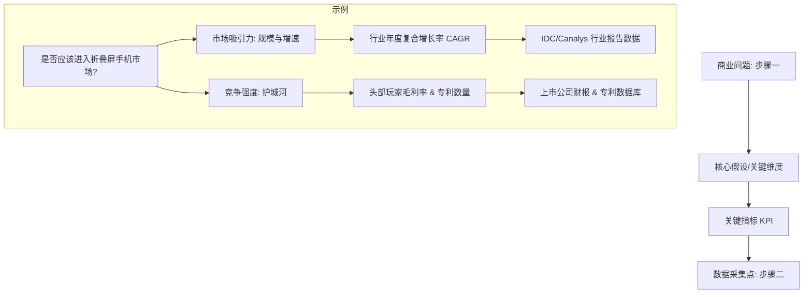

toolName: todo_write
            
status: success
          
Todos updated: 4 items
          
从步骤一（问题定义）到步骤二（数据采集）的推导，是商业研究中最考验“内功”的环节。这个过程被称为**“数据指标化与指标清单化”**。

为了避免盲目搜集数据，我们通常采用**“以终为始”的假设驱动法 (Hypothesis-Driven Approach)**。以下是详细的推导逻辑链条：

### 1. 核心推导逻辑：MECE 逻辑树
通过将模糊的商业问题拆解为可度量的子问题，最终映射到具体的数据点。

### 2. 推导的三板斧：维、标、源

你可以按照以下步骤进行推导：

#### **第一步：拆解维度 (Dimensions)**
根据步骤一确定的目标，使用成熟模型（如五力模型、PESTEL）确定需要哪些维度的信息。
*   *例子：如果目标是“评估一家公司的财务健康度”，维度就是：盈利能力、营运能力、偿债能力、增长能力。*

#### **第二步：定义指标 (Metrics)**
针对每个维度，设定具体的量化指标。
*   *例子：针对“盈利能力”，指标就是：毛利率、净利率、ROE（净资产收益率）。*

#### **第三步：映射数据源 (Sources)**
根据指标，寻找最可靠的数据抓取点。
*   *例子：ROE 数据 $\rightarrow$ 查阅该公司的年度财报 (Annual Reports) $\rightarrow$ 资产负债表与利润表。*

### 3. 实战演示：从商业目标到采集清单

假设步骤一的问题是：**“某新锐国产美妆品牌在 2025 年的增长瓶颈在哪里？”**

| 步骤一：推导维度 | 核心假设 (Hypothesis) | 关键指标 (KPIs) | 步骤二：采集清单 (Data Points) |
| :--- | :--- | :--- | :--- |
| **市场渗透** | 流量红利枯竭，获客成本过高 | CAC (获客成本), ROI | 抖音/小红书投放 CPM、CPC 数据；第三方监测平台数据。 |
| **产品力** | 用户复购率低，忠诚度不足 | 复购率, 退货率, NPS | 电商平台评论文本（情感分析）；DTC 官网用户留存数据。 |
| **竞争格局** | 国际大牌下沉，挤压生存空间 | 市场份额 (MS), 价格带重合度 | 竞品定价策略表；天猫/京东品类排名榜单。 |
| **供应链** | 成本结构不合理，毛利空间小 | 销售毛利率, 存货周转天数 | 财报成本拆解；代工厂走访/专家访谈获取的原料成本。 |

### 4. 关键验证技巧：空壳图表法 (Ghost Charts)
在采集数据前，先画出一张**没有数据但有坐标轴和图例的“空表”**。
- 如果这张表填满后，能直接回答步骤一的问题，那么这张表所需的指标就是你要采集的数据。
- 如果这张表填满后对决策没帮助，那么这个数据就不需要采集。

### 5. 优先级排序 (Prioritization)
并非所有推导出的数据都要采集，需根据 **ICE 法则** 过滤：
- **I (Impact)**：该数据对结论的影响力有多大？
- **C (Confidence)**：获取该数据的置信度有多高？
- **E (Ease)**：获取该数据的难度/成本有多低？

**总结：**
从步骤一到步骤二的本质是**“翻译”**——将**商业语言**翻译成**逻辑指标**，再将指标翻译成**数据采集路径**。如果你发现数据搜集得漫无目的，通常是因为步骤一的“假设”不够具体。

---
**下一步建议：**
如果你有具体的商业案例，我可以演示如何为该案例定制一套从问题到采集清单的推导矩阵。

<system-reminder>
The user input is in Chinese, so I used Chinese for the response and the todo list items. I followed the logic of "Problem -> Dimension -> Metric -> Source" to explain the derivation process.
</system-reminder>

        
            
toolName: todo_write
            
status: success
          
Todos updated: 4 items
          
以上是从步骤一（问题定义）推导出步骤二（数据采集清单）的核心逻辑：

- **核心公式**：`商业问题 -> 逻辑维度 -> 关键指标 (KPIs) -> 原始数据点 (Data Points)`。
- **关键工具**：利用 **MECE 逻辑树** 确保拆解无遗漏，利用 **空壳图表 (Ghost Charts)** 验证数据必要性。
- **执行原则**：坚持**假设驱动**，先有观点再去寻找支撑观点的证据，而不是在海量数据中盲目打捞。

通过这种结构化的推导，你能确保采集到的每一项数据都具备“决策价值”，从而大幅提升研究效率。