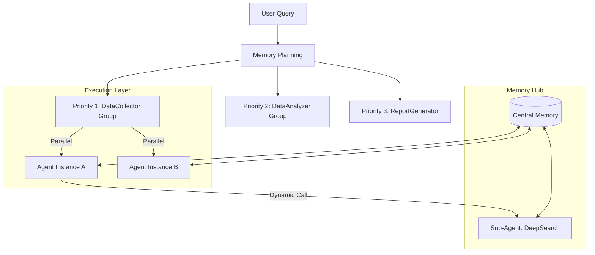

# FinSight 智能体编排架构说明 (Agent Orchestration)

本文档旨在从程序员视角深度解析 FinSight 项目中多个智能体（Agent）是如何协同工作、状态如何流转以及任务是如何被编排执行的。

## 1. 核心编排模型：分层并行调度

FinSight 采用的是一种**“规划 -> 队列 -> 优先级分组 -> 并行执行”**的静态与动态相结合的编排模式。

### 1.1 静态编排 (Planning Phase)
在 [run_report.py](file:///c:/Study/FinSight/run_report.py) 中，系统首先进入规划阶段：
- **任务拆解**：通过 LLM 分析用户的原始问题（如“研究某公司的投资价值”），利用 `Memory` 生成两类任务：
    - **数据采集任务 (Collect Tasks)**
    - **数据分析任务 (Analysis Tasks)**
- **任务注册**：这些任务被映射到具体的 Agent 类（如 `DataCollector`, `DataAnalyzer`），并根据任务类型分配 **优先级 (Priority)**。

### 1.2 优先级调度逻辑
任务队列按优先级从低到高（数值越小优先级越高）排序：
1.  **Priority 1 (数据采集)**：启动所有 `DataCollector` 实例。
2.  **Priority 2 (数据分析)**：在采集完成后启动，利用采集到的数据进行深度加工。
3.  **Priority 3 (报告生成)**：最后启动 `ReportGenerator`，汇总所有分析结果产出文档。

**技术实现**：同一优先级内的任务通过 `asyncio.gather` 实现**并发执行**，不同优先级之间通过顺序循环实现**串行阻塞**。

---

## 2. 动态编排：Agent as a Tool (递归调用)

除了顶层的静态编排，FinSight 还支持智能体之间的**动态嵌套调用**。

- **递归调用栈**：在 [base_agent.py](file:///c:/Study/FinSight/src/agents/base_agent.py) 中，如果一个 Agent 的工具列表中包含另一个 Agent，它可以通过 `call_tool` 像调用普通函数一样启动子智能体。
- **上下文隔离**：每个子智能体拥有独立的 `agent_id` 和 Python 执行环境，这种递归模式有效地解决了复杂任务下 LLM 注意力分散和上下文过长的问题。

---

## 3. 编排的“粘合剂”：Memory 系统

[variable_memory.py](file:///c:/Study/FinSight/src/memory/variable_memory.py) 是整个编排体系的中心枢纽：

### 3.1 任务指纹与幂等性
- **Task Key**：Memory 根据任务输入计算唯一指纹。
- **单例保证**：确保同一个任务在整个生命周期内只由一个唯一的 `agent_id` 负责。如果任务重启，Memory 会负责找回那个“曾经的 Agent”。

### 3.2 跨 Agent 数据共享 (Data Flow)
- **解耦通信**：Agent A（采集员）将数据存入 Memory，Agent B（分析师）通过数据 ID 或语义检索从 Memory 中提取。Agent 之间不直接传递海量数据，而是通过 Memory 这个“中央仓库”进行中转。

---

## 4. 稳健性保障：双重快照机制

为了支持长耗时任务的断点续传，编排系统为每个 Agent 实例维护了两个快照文件：

1.  **`latest.pkl` (业务快照)**：
    - 记录：对话历史、当前轮次、任务元数据、子 Agent 依赖。
    - 目的：恢复 Agent 的**决策进度**。
2.  **`state.dill` (环境快照)**：
    - 记录：Python 全局变量 (`globals()`)、自定义函数源码、导入的模块。
    - 目的：恢复 Agent 的**执行现场**。

---

## 5. 编排流程总结图

**一句话总结**：FinSight 的编排逻辑是**以 Memory 为核心，通过优先级实现宏观调度，通过 Agent-as-Tool 实现微观协作，并利用双重快照确保全流程的可追溯与可恢复。**
