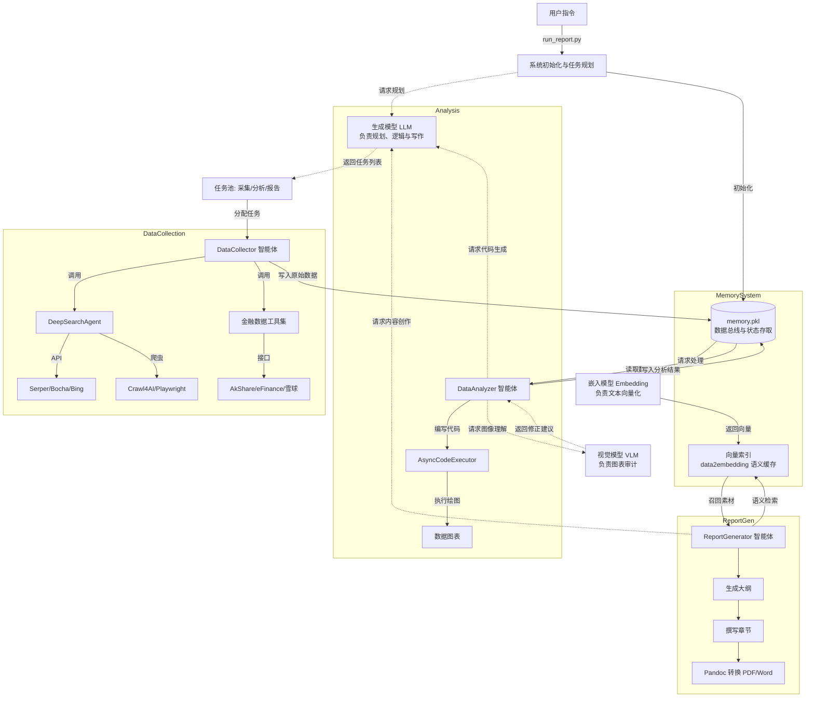

# FinSight 工程架构流程图

本文档详细描述了 FinSight 项目的整体业务逻辑、智能体协作、数据缓存机制以及底层模型提供方。

## 核心架构说明

### 1. 独立模型层 (Independent Providers)
系统将 AI 能力抽象为三个独立的服务提供方，实现了业务逻辑与模型能力的解耦：
- **生成模型 (LLM)**: 作为全局逻辑大脑，负责任务规划、代码生成和最终的报告撰写。
- **嵌入模型 (Embedding)**: 专门负责非结构化文本的向量化，为语义检索提供底层支持。
- **视觉模型 (VLM)**: 专注于图表质量的自动化审计，确保生成的财务图表准确美观。

### 2. 多级缓存机制 (Multi-level Caching)
- **全局缓存**: `memory.pkl` 持久化存储整个系统的状态，确保任务可中断并恢复。
- **向量缓存**: `data2embedding` 存储已向量化的文本，避免重复调用 API。
- **环境缓存**: `state.dill` 记录 Python 解释器的变量状态，保证分析过程的连续性。

### 3. 数据与采集 (Data & Collection)
- **API 提供方**: 核心依赖 AkShare，涵盖了东财、新浪、金十等主流财经数据源。
- **爬虫提供方**: 整合了 Crawl4AI 和 Playwright，支持静态内容抓取与复杂的动态网页交互。
